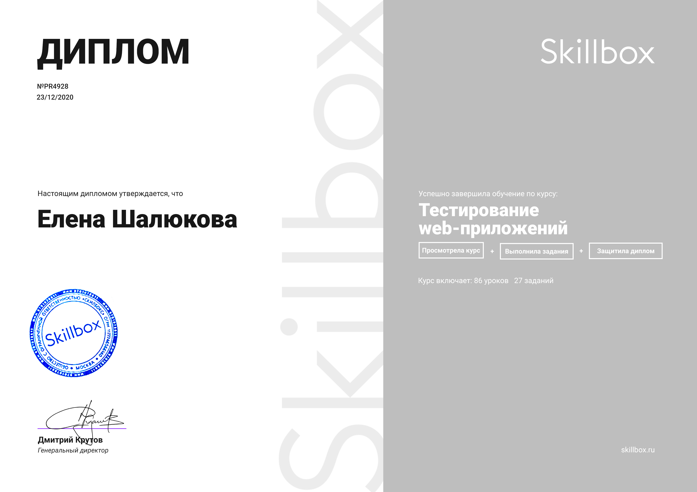

## I love autotests

Languages and Tools

***

## Применяемые технологии и инструменты       :pushpin:

</code>
<code></code>
<code></code>
<code></code>
<code></code>
<code></code>
<code></code>
<code></code>
<code></code>
<code></code>

***

<code></code>

 
